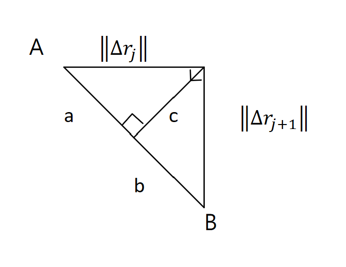

在學習變分的時候，常會看到least action principle、Lagrangian and Hamiltonian formulation等等，但在這之前，我們單純問一個簡單的問題：

對於一個自由粒子，從固定的A點走到固定的B點，在不受外力的情況下，最短軌跡怎麼求？

很直覺的答案就是，粒子會遵循等速直線運動，軌跡畫出來就是一條直線嘛！

但這裡開始引入一個概念：

**大自然有著讓東西極小或極大化的特性。所以我們的目標就是，希望能透過數學描述這個現象，找到一個大自然會最小化的物理量，得出這條最短軌跡。**

## 建立最短軌跡的公式

那我們開始來算，首先A點到B點，中間路徑隨便怎麼畫，但我們把它分成一段一段的

$$
\|\Delta\vec{r}_1\|+\|\Delta\vec{r}_2\|+...+\|\Delta\vec{r}_N\|
$$

總和的值就是我們想要最小化的路徑。

但是！

想要最小化這個公式，有四個注意的點：

- 這個公式只有確保是最小路徑，沒有引入「等速」的概念。沒有保證 $$\|\Delta\vec{r}_1\| = \|\Delta\vec{r}_2\| = \cdots = \|\Delta\vec{r}_N\|$$，也沒有說明每一小段走的時間相同。
- 同理，沒有引出「直線」的概念。
- 應要增加時間的條件，限制整段路徑在總時間T內完成，並平分成N段，每段時間長度為T/N。
- 要繼續用絕對值來求有點難算，我們可以轉成平方項來處理。

綜合以上，我們改求想要最小化這個公式：

$$
\|\Delta\vec{r}_1\|^2+\|\Delta\vec{r}_2\|^2+...+\|\Delta\vec{r}_N\|^2
$$

然後確認最小化這個公式保證「直線」與「等速」：

1. 證明直線：\
   我們將問題先縮到局部的範圍，最後再放大至全域，因此可以先看兩點 $$\Delta\vec{r}_j$$、$$\Delta\vec{r}_{j+1}$$。假設先接受一個最短路徑的答案後，調整中間經過的位置，使之稍微偏離，如果算出來的數學量比較大，那就證明原本給的答案就是最小的。\
   \
   如下圖所示，原本A到B是直線a+b，現在稍微偏離一點走$$\|\Delta\vec{r}_j\|+\|\Delta\vec{r}_{j+1}\|$$，算出來恆大於a+b，所以最小化兩者平方和的結果，一定是直線。

   

   $$
   \|\Delta\vec{r}_j\|^2+\|\Delta\vec{r}_{j+1}\|^2=(a^2+c^2)+(b^2+c^2) = (a^2+b^2)+2c^2 \geq a^2+b^2
   $$

2. 證明線段等長：\
   若

   $$
   a+b=\|\overline{AB}\|(\text{fixed})
   $$

   最小化

   $$
   a^2+b^2
   $$

   可得(這裡簡單的取$$a^2+(L-a)^2$$微分就可導出來)

   $$
   a = b = \frac{1}{2}\|\overline{AB}\|
   $$

至此，還差最後一步。對於切的N段，N要多大呢？

如果固定長度下，切更細，分更多段，感覺應該能更精確？但是別忘了，這是固定長度！也就是說，如果長度是一公尺，切一千份，每一份都是$$(\frac{1}{10^3})^2$$，算出來就是

$$
(\frac{1}{10^3})^2 \times 10^3 = \frac{1}{10^3}
$$

改切一億份

$$
(\frac{1}{10^8})^2 \times 10^8 = \frac{1}{10^8}
$$

那我越切越細，最小化的公式算出來的數值不就愈來越小了？

這只是我們Formulate的關係，那就再把數量乘回來吧，不會影響我們要做的事情，因此最小化的公式改成：

$$
\left[\|\Delta\vec{r}_1\|^2+\|\Delta\vec{r}_2\|^2+\cdots+\|\Delta\vec{r}_N\|^2\right] \cdot {N}
$$

然後數量級改一下變成有限項

$$
\left[\left(\frac{\Delta\vec{r}_1}{\frac{1}{N}}\right)^2+\left(\frac{\Delta\vec{r}_2}{\frac{1}{N}}\right)^2+\cdots+\left(\frac{\Delta\vec{r}_N}{\frac{1}{N}}\right)^2\right]\cdot\frac{1}{N}
$$

把前面時間的概念放回來($$\Delta{t_1} = \Delta{r_1}$$ 走的時間)

$$
\because \quad \frac{1}{N} \propto \frac{T}{N} = \Delta{t_1}(=\Delta{t_2}=\cdots=\Delta{t_N}), \qquad	\Delta{t_j} \equiv \frac{T}{N}
$$

$$
\therefore \left[\left(\frac{\Delta\vec{r}_1}{\frac{1}{N}}\right)^2+\left(\frac{\Delta\vec{r}_2}{\frac{1}{N}}\right)^2+\cdots+\left(\frac{\Delta\vec{r}_N}{\frac{1}{N}}\right)^2\right]\cdot\frac{1}{N}
$$

$$
\Rightarrow\left[\left(\frac{\Delta\vec{r}_1}{\Delta t}\right)^2+\left(\frac{\Delta\vec{r}_2}{\Delta t}\right)^2+\cdots+\left(\frac{\Delta\vec{r}_N}{\Delta t}\right)^2\right]\cdot\Delta t
$$

$$
\Rightarrow\int_{0}^{T} \left(\frac{d\vec{r}}{dt}\right)^2\,dt
$$

這個就是最後我們在求最短路徑時，要最小化物理量的公式積分形式。

